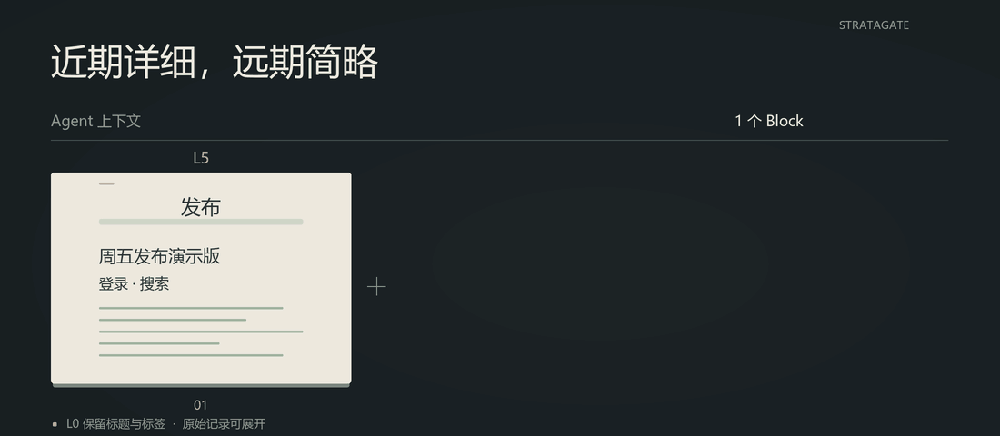
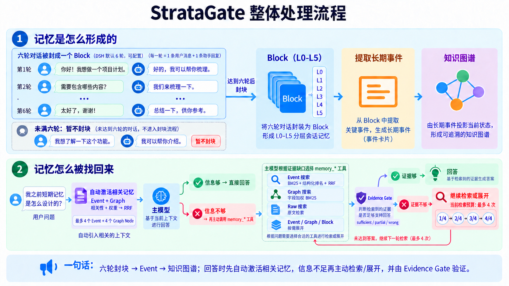
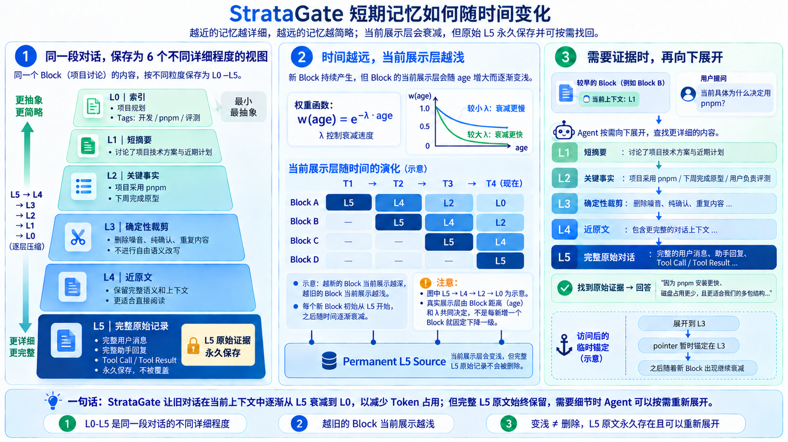
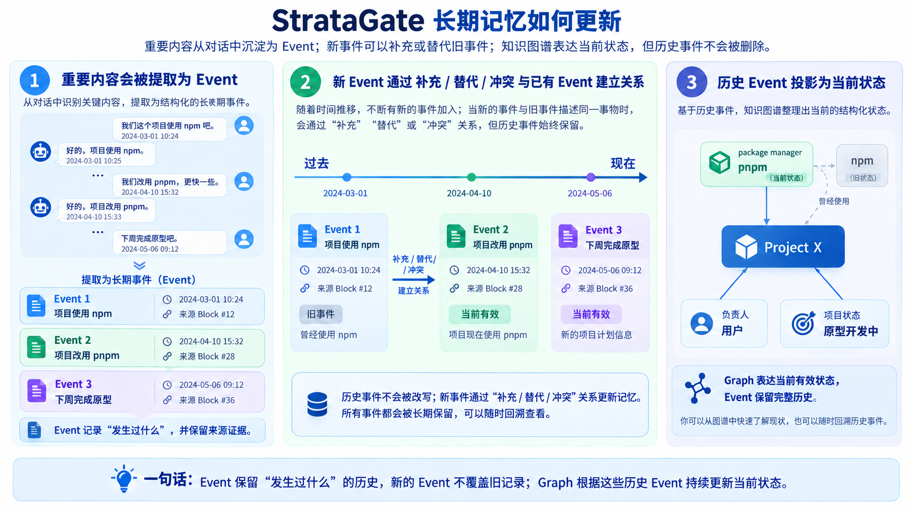
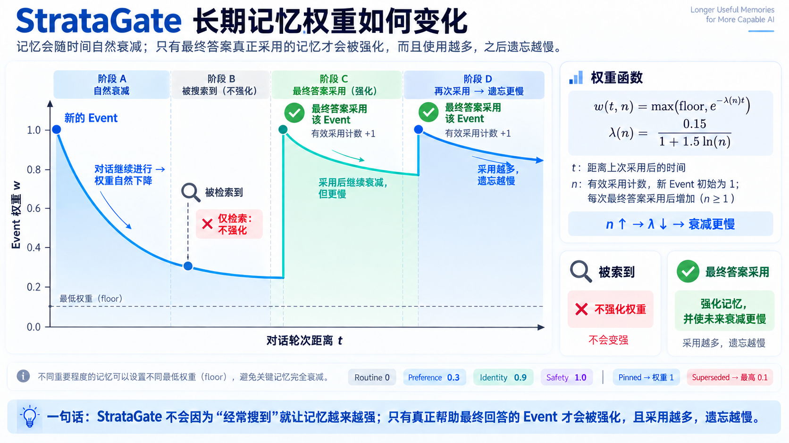

<div align="center">


# StrataGate

### 近期对话保留细节，远期记忆逐渐简化。

StrataGate 让 AI Agent 的短期记忆随对话推进逐渐变得简略，需要时可重新展开、找回原始细节；重要信息则沉淀为事件与知识图谱，持续记录历史变化与当前状态，供后续会话使用。

[](https://github.com/diqierjia/StrataGate-AgentMemory/actions/workflows/ci.yml)
[](https://www.npmjs.com/package/stratagate-dsh)
[](LICENSE)
[](https://www.typescriptlang.org/)
[](https://awesome-dsh-plugin.com)
[](CONTRIBUTING.zh-CN.md)

[English](README.md) · [DeepSeek Harness 插件说明](docs/DSH.zh-CN.md) · [架构说明](docs/ARCHITECTURE.md) · [完整评测](docs/EVALUATION.md)

<strong>当前公开结果：</strong>在 LoCoMo `conv-26` 上，StrataGate 经过 10 次独立评审的平均准确率为 <strong>80.46%</strong>，Mem0 base 为 <strong>63.22%</strong>。[查看测试范围与方法](#实验结果)。

</div>

> **简单来说：** StrataGate 让近期对话保留细节，让较早的对话随对话推进逐渐简化；重要信息则整理为事件与知识图谱，供后续会话使用。原始记录始终保留，需要时可以重新展开、核对细节。

## 为什么选择 StrataGate？

1. **短期记忆：随对话推进逐渐模糊，需要时重新展开。**

   (1) **近期详细，远期简略。** 同一段对话保存为 L0–L5 六种详细程度的视图。随着后续对话积累，较早的记忆逐渐从完整对话变为关键事实、简短摘要和标题索引，减少历史内容对上下文的占用。→ [分层记忆](#layered-memory)

   (2) **展示变简，原始记录保留。** 完整的 L5 原始消息与工具记录始终保存。需要核对细节时，Agent 可以按需展开，找回当时的原话和上下文。→ [分层记忆](#layered-memory)

   

2. **长期记忆：用事件线保留历史，用知识图谱整理当前状态。**

   (1) **事件记录“发生过什么”。** 对话中的重要决定、偏好、计划和变化会被提取为 Event，保留来源，并区分“什么时候提到”和“什么时候发生”，供后续会话查找和追溯。→ [事件卡](#event-cards)

   (2) **知识图谱表达“当前是什么状态”。** 根据历史事件，整理人物、项目、组织、工具和地点的当前信息及关系。新事件可以补充或取代旧状态，历史事件及其来源仍然保留。→ [当前状态图谱](#current-state-graph)

   (3) **长期权重也会衰减。** 随着对话推进，未被采用的记忆权重逐渐降低，影响检索与自动召回时的优先级；衰减后的记忆仍保留来源，可继续查证。→ [权重与采用强化](#use-only-reinforcement)

   (4) **支持迁移其他 AI 的记忆。** 导入内容可以转换为可追溯的事件，并用于更新知识图谱；原始导入内容仍会保留。→ [外部记忆导入](#external-memory-import)

3. **证据门：回答前先检查检索到的证据是否够用。**

   搜索结果相关，不代表足以回答当前问题。Agent 会判断证据是否充分；不足时继续搜索、展开事件或回查原始消息，仍无法确认时明确说明不确定性。→ [证据门](#evidence-gate)

4. **只强化实际使用的记忆。**

   搜索命中或自动带入上下文不会触发强化。只有被记录为最终答案实际采用的证据，才会增加采用计数、更新衰减起点；采用越多，之后衰减越慢，避免记忆仅因频繁被搜到就不断强化自身。→ [只强化实际使用的记忆](#use-only-reinforcement)

开始使用：→ [快速开始](#quick-start-deepseek-harness)

## 选择适合你的入口

| 使用方式 | 适合谁 | 从哪里开始 |
| --- | --- | --- |
| **DeepSeek Harness 插件** | 希望自动获得本地记忆和可视化记忆界面的 DSH 用户 | [安装 `stratagate-dsh`](#quick-start-deepseek-harness) |
| **TypeScript 核心库** | 正在开发自定义 Agent 或记忆接入的开发者 | [代码入口](#代码入口) |

<a id="quick-start-deepseek-harness"></a>

## 快速开始：DeepSeek Harness

如果已经安装 DeepSeek Harness，请将 StrataGate 添加到你正在使用的 profile：

```bash
dsh plugin --profile web add stratagate-dsh
```

重启该 profile，之后照常使用 DSH 即可。StrataGate 会自动记录主 Agent 已完成的对话，在后台生成可搜索的记忆，并在 **DSH 设置 → StrataGate-AgentMemory** 中提供记忆界面。

数据库默认保存在：

```text
DSH_HOME/stratagate/memory.db
```

移除插件不会删除数据库。截图、配置项、记忆工具和自动记录规则见 [DeepSeek Harness 插件中文说明](docs/DSH.zh-CN.md)。

## 这些设计要解决什么问题

随着对话不断积累，AI Agent 需要在有限的上下文中，同时处理眼前的任务、之前的讨论和长期有效的信息。

近期讨论通常需要完整细节，较早的对话则可以先保留简短概括，等到需要时再展开。与此同时，用户偏好、项目决定和任务计划还会发生变化，需要区分历史记录与当前状态。StrataGate 围绕这些需求，分别管理短期记忆的展示、长期记忆的更新，以及检索后的判断和使用反馈。

| 常见问题 | StrataGate 的处理方式 |
| --- | --- |
| 对话越来越长，历史细节持续占用上下文 | 将同一段对话保存为 L0–L5 分层视图；随着后续对话积累，较早的内容默认展示得更简略，需要时再展开 |
| 重要信息分散在不同对话中，旧决定与新状态容易混淆 | 提取带来源和时间的 Event，用事件线保留历史，再通过知识图谱整理当前状态 |
| 搜到了相关内容，却缺少回答问题所需的关键细节 | 通过证据门评估当前材料；不足时继续搜索、展开记忆或回查原文 |
| 记忆仅因频繁被搜到，就不断获得更高权重 | 将检索与采用分开：长期权重随对话推进衰减，只有记录为实际采用的记忆才触发强化 |

短期记忆衰减，让旧对话逐渐减少在当前上下文中呈现的细节；长期记忆及其权重机制，帮助 Agent 在后续会话中找回仍然有用的信息。两者都保留来源，使简化后的内容能够继续追溯和核对。

<a id="how-stratagate-works"></a>

## 它如何工作



StrataGate 的工作过程分为记忆形成、回答时找回，以及采用后的反馈。

### 1. 对话积累，形成分层短期记忆

每轮完成的对话及工具记录会先保存。DeepSeek Harness 插件默认每 **6 轮**封存一个 Block，用户可以调整这一大小；尚未达到边界的内容继续保留在当前对话中。

每个 Block 保存 L0–L5 六种详细程度的视图，从标题索引、简短摘要到完整原始记录。后台处理完成后，Block 才开始参与衰减：随着同一会话中的后续就绪 Block 增加，较早的 Block 默认展示层逐渐变浅。

这个过程减少的是当前上下文中呈现的历史细节，完整的 L5 原始记录仍然保留。→ [分层记忆](#layered-memory)

### 2. 重要信息沉淀为 Event，并更新知识图谱

对话中值得长期保留的决定、偏好、计划和变化，会被提取为 Event。每条事件记录内容、时间和来源，供之后的会话查找。

知识图谱再根据这些事件，整理人物、项目、工具等实体的当前信息和关系。新事件可以补充或取代旧状态，历史事件及其来源继续保留。→ [事件卡](#event-cards) · [当前状态图谱](#current-state-graph)

### 3. 回答前自动带入相关记忆，需要时主动检索

每次主模型调用前，插件会根据当前问题和最近的对话，自动带入少量相关的长期 Event 与图谱信息，为回答提供背景。

当前 DSH 实现最多带入 **4 条 Event 和 4 个图谱节点**，并受约 **900 tokens** 的总预算限制。当前会话的历史则通过分层 Block 和尚未封存的对话提供。

如果已有上下文足够，Agent 可以直接回答；如果还缺少信息，就通过记忆工具搜索事件、图谱或原始消息，并按需展开更详细的内容。

### 4. 主动检索后，检查证据是否足以回答

找到相关记忆后，Agent 需要判断它是否真正回答了当前问题：哪些证据可以使用，还缺少什么，以及是否需要继续查找。

例如，“项目使用 pnpm”可以回答当前采用什么工具，但不足以回答“当初为什么选择 pnpm”。遇到这种情况，Agent 应展开相关事件或回查原始讨论。

证据门要求模型明确给出这份判断，并由代码检查证据引用和流程约束。证据仍然不足时，Agent 需要继续查找，或明确说明无法确认。→ [证据门](#evidence-gate)

### 5. 记录实际采用的证据，更新长期权重

搜索命中或自动带入上下文，不会触发记忆强化。

当 Agent 确定哪些证据用于最终回答时，会提交采用回执。被记录为实际采用的 Event 更新采用计数和衰减起点；采用次数越多，之后衰减越慢。没有采用的搜索结果不会获得这次强化。→ [只强化实际使用的记忆](#use-only-reinforcement)

例如，用户先决定“项目使用 npm”，后来改为“项目使用 pnpm”。StrataGate 会保留这两次决定，并在知识图谱中更新当前选择。之后询问“现在用什么”，可以从当前状态中找到答案；询问“什么时候改的、为什么改”，则可以沿 Event 回到当时的对话，核对时间和原因。

[查看一次从事件卡回查原始消息的检索示例](#一次真实的检索)。

## 核心设计

StrataGate 分别管理对话的展示层级、长期信息的更新、检索证据的判断，以及记忆被采用后的反馈。

其中，**短期记忆衰减决定旧对话展示得多详细，长期记忆权重影响信息在后续召回中的优先级**。这两种变化都不会因衰减而删除原始来源。

<a id="layered-memory"></a>

### 1. 短期记忆：随对话推进逐渐简化，需要时重新展开

近期讨论通常需要保留完整细节，较早的对话则可以先以简短形式留在上下文中。StrataGate 为同一段对话保存多种详细程度的视图，并随着后续对话积累，逐渐减少旧对话默认呈现的内容。



**同一段对话，保存为六种详细程度。**

DeepSeek Harness 插件默认每 **6 轮**完整对话封存一个 Block，一轮指一次用户提问和助手的完整回复。封块大小可以配置；核心库默认值为 12 轮。尚未达到边界的内容继续保留在当前对话中。

每个完成处理的 Block 包含以下视图：

| 层级 | 保存的内容 | 主要用途 |
| --- | --- | --- |
| L0 | 标题和标签 | 用最少内容标识这段历史 |
| L1 | 简短摘要 | 快速了解讨论主题 |
| L2 | 关键事实 | 查看决定、约束、计划和结果 |
| L3 | 确定性精简对话 | 删除固定白名单中的独立寒暄或确认；重复的长段落与代码只保留第一次；工具调用保留名称和结果摘要 |
| L4 | 去除内部记录的近原文对话 | 过滤 system 消息；用户和助手正文只裁剪首尾空白并添加角色标签；可识别的工具记录保留名称和结果摘要 |
| L5 | 原始消息与工具记录 | 查证来源及具体细节 |

L0–L2 由模型概括生成；L3、L4 不调用模型改写，而是由程序按以下固定规则生成：

- **L4：** 删除 system 消息；用户和助手正文只裁剪首尾空白并添加 `User`、`Assistant` 等角色标签。对于能够识别的结构化工具记录，只保留工具名称和最长 160 字符的结果摘要，省略原始 `arguments`、`params`、`input` 和 `request`；无法识别为工具 JSON 的 tool 正文保持原样。
- **L3：** 在不改写语义的前提下进一步精简。只有当整句去掉末尾标点后命中固定白名单时，才删除 `ok`、`thanks`、`好的`、`明白`、`收到`、`谢谢`、`可以` 等独立寒暄或确认。程序把连续空白合并并忽略大小写后，对代码型段落或至少 80 字符的长段落去重：第一次保留原文，之后的完全重复内容替换为省略标记。工具记录采用与 L4 相同的名称和结果摘要形式。
- **长度保护：** 如果生成的 L4 比 L5 更长，就直接使用 L5；如果 L3 比 L4 更长，就直接使用 L4，确保 `L3 ≤ L4 ≤ L5`。

原始记录先保存，摘要和事件处理随后进行。只有处理完成、进入就绪状态的 Block，才会替换对应的原生历史并参与衰减。

**后续对话越多，旧 Block 默认展示得越简略。**

Block 的展示变化由指数衰减控制：

<p align="center"><strong>w<sub>block</sub>(age) = e<sup>−λ<sub>block</sub> · age</sup></strong></p>

其中，衰减系数 λ<sub>block</sub> 默认取 **0.30**，程序根据权重区间选择当前展示层级。系数越小，详细内容保留得越久，相应占用的上下文也越多。

公式中的 `age` 按当前展示锚点与同一会话最新就绪 Block 之间的距离计算。它衡量的是对话积累的进度，**不是现实中经过的天数**。尚未封存的对话，以及仍在等待模型处理的 Block，都不会推动这项衰减。

例如，一个从 L5 开始、期间没有重新展开的 Block，在默认参数下会经历：

| 后续新增的就绪 Block 数量 | 默认展示层 |
| ---: | --- |
| 0–1 | L5 |
| 2 | L4 |
| 3–4 | L3 |
| 5–6 | L2 |
| 7–8 | L1 |
| 9 及以上 | L0 |

图中的层级变化用于展示趋势，实际变化由衰减参数和层级阈值共同决定，并非每新增一个 Block 就下降一级。

**需要细节时，可以重新展开。**

假设某段旧对话目前只显示：

> 讨论了项目技术方案与近期计划。

用户追问“当初为什么选择 pnpm”，Agent 可以展开关键事实、精简对话或完整原始记录，找到当时的原因。

展开既可以逐级进行，也可以直接指定更详细的层级。展开后，系统会以此次选定的层级和当前 Block 位置重新设置衰减起点；随着后续对话继续积累，它再逐渐变简。

因此，旧对话日常可以保持轻量，需要时仍能恢复细节。**L0–L4 都是原始记录的派生视图，不会覆盖 L5。**

<a id="event-cards"></a>

### 2. 长期记忆：事件线保留历史，知识图谱整理当前状态

短期记忆保留一段讨论的上下文，长期记忆则把值得在后续会话中继续使用的信息提取出来。StrataGate 用 Event 记录决定、偏好、计划和变化，再根据这些事件整理知识图谱。



**事件卡记录发生过什么，并保留来源。**

同一个 Block 可以产生多条 Event，也可以没有需要提取的长期信息。每条事件除了内容，还保存来源 Block、来源消息，以及可确定的时间信息。

时间信息需要区分两个含义：

| 时间 | 表示什么 |
| --- | --- |
| 提及时间 | 这件事什么时候在对话中被说到 |
| 发生时间 | 事情实际发生或计划发生的时间 |

例如，用户在 5 月 6 日说“下周完成原型”，5 月 6 日是提及时间，“下周”描述的是计划完成时间。这条记录应保留计划性质，不能直接作为“原型已经完成”的证据。

当时间无法确定时，保留原始表达和不确定性，方便之后回到来源核对。

**新事件通过补充、取代或冲突关系更新记忆。**

项目讨论可能先后出现：

> “这个项目使用 npm。”
>
> “我们改用 pnpm。”
>
> “下周完成原型。”

这三条信息的作用不同：

- “改用 pnpm”更新了包管理器选择，旧 npm 事件保留为历史。
- “下周完成原型”补充了一项计划，不影响包管理器选择。
- 如果出现无法同时成立、又不能确定哪条有效的说法，则保留冲突关系，供后续核实。

旧事件的内容和来源不会被新事件覆盖，其有效状态和关联关系可以随新证据更新。因此，系统既能找到当前有效的信息，也能回答“以前是什么样、后来发生了什么变化”。

<a id="current-state-graph"></a>

**知识图谱根据事件整理当前信息和关系。**

图谱将人物、项目、组织、工具和地点表示为节点，将“使用”“参与”“依赖”等联系表示为有方向的关系。节点属性和关系都保留来源 Event。

在上述例子中，图谱可以把项目当前使用的包管理器更新为 pnpm，同时保留 npm 的历史状态。之后：

- 问“项目现在使用什么”，可以先查当前图谱；
- 问“什么时候改的”，可以查变更事件；
- 问“为什么改”，可以进一步展开事件并回查原始讨论。

图谱中的状态需要与来源一致。“下周完成原型”直接支持的是一项计划；图中展示的“原型开发中”或“负责人”等信息，需要相应事件提供额外依据。

图谱更新作为独立任务执行并保存进度。更新失败时，可以单独重试，已经写入的事件和原始来源仍然保留。

<a id="evidence-gate"></a>

### 3. 证据门：检查检索结果是否足以回答当前问题

找到相关记忆之后，还需要判断它能否支持当前答案。StrataGate 通过一个固定、简短的评估结构，要求 Agent 明确说明证据是否充分，以及接下来应当做什么。

| 评估项 | 需要说明的内容 |
| --- | --- |
| `verdict` | 证据充分、部分充分，还是与问题不符 |
| `evidence_refs` | 哪些检索结果支持当前判断 |
| `fit` | 证据与问题具体匹配在哪里 |
| `missing` | 还缺少哪些信息 |
| `next_strategy` | 直接回答，还是继续搜索或展开 |

例如，用户问：

> 为什么当初改用了 pnpm？

检索结果只有：

> 项目已从 npm 改为 pnpm。

这条结果确认了变更，却没有说明原因。Agent 应将其判断为部分充分，继续展开事件或回查原始对话，而不能仅凭工具选择推测当时的理由。

证据门由模型判断内容是否充分，程序负责检查引用和流程约束：被引用的证据必须来自指定检索批次；接受 `sufficient` 时，需要有效证据引用，并明确选择回答。

这些检查使检索过程可以追踪和核验，但模型仍可能误判证据。没有找到足够信息时，应继续查找，或在回答中明确说明无法确认。

<a id="use-only-reinforcement"></a>

### 4. 只强化实际使用的记忆：采用越多，之后衰减越慢

长期记忆也会随对话推进而衰减。这里变化的是 Event 的权重，它参与后续召回和排序；与短期 Block 不同，Event 不会因此逐级切换 L0–L5 展示层。



**新事件具有初始权重，未被采用时逐渐衰减。**

长期 Event 的基础权重函数为：

<p align="center"><strong>w(t,n) = max(floor, e<sup>−λ(n)t</sup>)</strong></p>

<p align="center"><strong>λ(n) = 0.15 / (1 + 1.5 ln(n))</strong></p>

其中：

- `t` 是当前轮次与上次采用轮次的差，新事件从创建时开始计算；
- `n` 是内部采用计数，初始化为 1，每次记录采用后增加 1；
- `floor` 是根据记忆重要程度设置的最低权重。

长期权重衰减同样按对话轮次计算，而不是按现实时间计算。较低的权重可能降低一条记忆在后续召回中的优先级，但不会因衰减而删除它的历史记录。

**被搜索到，不会触发强化。**

检索命中只说明一条记忆可能相关。系统可以记录它何时被检索，但不会因此增加采用计数，也不会重置衰减起点。

自动带入上下文的记忆同样不会因为被展示而获得强化。这样可以避免某条记忆仅因偶然排在前面，就通过反复出现不断提高自身权重。

**记录为实际采用后，才更新权重。**

Agent 确定用于最终回答的证据后，会提交采用回执。通过检查的 Event 增加采用计数，并把衰减起点更新到当前轮次。对于未被额外限制权重的普通活跃事件，此时权重回到 1。

随着采用计数增加，公式中的衰减系数变小，同样经过一段对话后，它能保留更高的权重。因此，反复帮助回答的记忆会逐渐衰减得更慢。

采用依据来自 Agent 提交的证据选择。程序检查证据是否属于对应批次、是否经过充分性评估，并通过回执避免同一次操作被重复执行；没有使用的检索结果不获得这次强化。

**不同重要程度的记忆，可以保留不同的最低权重。**

| 记忆类别 | 默认最低权重 |
| --- | ---: |
| 普通信息 | 0 |
| 用户偏好 | 0.3 |
| 身份信息 | 0.9 |
| 安全信息 | 1.0 |

此外，置顶记忆的有效权重保持为 1；被取代的事件通常设置较低的权重上限，避免旧状态持续占据较高优先级。

这些权重表达的是记忆管理策略，不能当作事实正确率。权重较高的信息仍需要结合当前问题、最新状态和原始来源进行判断。

<a id="external-memory-import"></a>

## 外部 AI 记忆迁移

可以把另一个 AI 的记忆总结直接迁移到 StrataGate。`importExternalMemory()` 将导入拆成固定的五步：

```text
外部 AI 总结
    ↓ extractor：提取候选 Event
    ↓ searchEvents：每个候选只检索现有 Event 的 Top-K
    ↓ decider：ADD / MERGE / SUPERSEDE / CONFLICT / IGNORE
    ↓ 写入新 Event，保留旧 Event 与来源链
    ↓ 仅为新写入的规范 Event 创建图谱投影任务
```

库导出 `EXTERNAL_MEMORY_EXPORT_PROMPT_ZH_CN`、`EXTERNAL_MEMORY_DECIDER_PROMPT_ZH_CN` 和 `externalMemoryJsonExtractor`，可让外部 AI 输出可校验的 `stratagate.external-memory.v2` JSON，再由本地模型从五种处理方式中选择。v2 将记忆性质与内容分类分开；时间字段严格区分“被提及时间”和“实际发生时间”。日期不确定时，系统会省略日期并保留原始说法，不会根据当前日期或聊天顺序猜测。

完整接入示例和提示词说明见 [`docs/EXTERNAL_MEMORY_IMPORT.zh-CN.md`](docs/EXTERNAL_MEMORY_IMPORT.zh-CN.md)。DeepSeek Harness 管理界面会先预览导入，JSON 不合格时使用模型兜底恢复，确定性忽略完全重复项，并让当前模型结合 Top-K 本地匹配选择新增、合并、取代、冲突或忽略。导入分析及逐条进度会持久化，关闭后重新打开页面可继续查看；高置信度判断自动采用，低置信度项可人工选择具体动作；提交后可按批次撤销。

新事件可以取代旧事件，但旧事件及其来源仍然保留。遗忘可以让事件退出搜索，同时不破坏来源链路。

## 一次真实的检索

LoCoMo 中有一道题询问 Caroline 在什么时候进行了学校演讲。

事件卡已经找到了“学校演讲”，但卡片本身没有包含足够的日期信息：

```text
search_events
        ↓
命中“学校演讲”事件卡
        ↓
事件相关，但没有具体日期
verdict = partial
missing = 发生日期
        ↓
search_raw_memory
        ↓
找到 2023-06-09 的原始消息
其中写着 “last week”
        ↓
结合消息时间解析相对日期
verdict = sufficient
        ↓
回答
```

这个过程里：

- 事件卡负责快速定位；
- 来源时间戳和原始消息负责最终核对；
- 证据门要求 Agent 识别缺失信息，并在证据不足时继续查证。

## 实验结果

仓库公开的 R8 对比评测使用 LoCoMo 中的 `conv-26` 对话样本，包含 **419 条消息、35 个会话和 152 道问题**，覆盖 category 1–4。

两个系统分别生成答案，再对每道题的答案进行 **10 次独立 Judge 评审**。这里的十次指评审重复次数，不代表十次完整系统运行。

| 指标 | StrataGate | Mem0 base | 差值 |
| --- | ---: | ---: | ---: |
| 10 次评审平均准确率 | **80.46%** | 63.22% | **+17.24 个百分点** |
| 多数票正确 | **121 / 152（79.61%）** | 96 / 152（63.16%） | **+25 题** |
| 时间类问题（Temporal） | **74.86%** | 34.59% | **+40.27 个百分点** |
| 单跳问题（Single-hop） | **89.29%** | 75.14% | **+14.14 个百分点** |
| 多跳问题（Multi-hop） | **66.56%** | 61.56% | +5.00 个百分点 |
| 开放域问题（Open-domain） | 83.08% | **84.62%** | -1.54 个百分点 |

两边使用相同的问题、顺序、答案模型、Judge 模型、评审提示词、解析器和评审次数，并分别重新构建记忆。记忆抽取、检索实现、embedding 使用方式和回答上下文存在差异，因此这里比较的是两套完整系统配置。

这组结果仅覆盖 `conv-26`，不代表完整 LoCoMo 成绩，也不能单独证明短期记忆衰减、知识图谱或证据门中某一项机制带来的收益。各组件的独立作用仍需通过消融实验检验。

完整协议、逐题结果及评审波动见 [评测文档](docs/EVALUATION.md)，汇总数据见 [机器可读评测结果](benchmarks/locomo-conv26-r8-final.json)。

## 这些设计是怎么形成的

多轮实验中的失败案例，帮助 StrataGate 逐步明确了记忆处理与检索策略：

- **时间信息需要单独保存。** 仅靠摘要不容易恢复事件日期，因此事件卡区分提及时间与发生时间，并保留原始时间表达和来源。
- **证据判断需要简短、明确。** 将判断限制在五个字段内，让 Agent 明确说明证据、缺口和下一步，也便于程序检查引用。
- **反复搜索没有新增信息时，需要换一种查找方式。** 当事件卡缺少关键细节时，展开来源或检索原始消息，比重复搜索同一批卡片更有价值。

R1–R8 的完整实验过程、版本差异和逐题分析保留在 [评测文档](docs/EVALUATION.md)中。不同轮次之间存在多项调整，这些观察用于解释设计选择，不作为单个组件效果的独立证明。

## 当前局限与下一步

上述 R8 评测中，仍有 **31 道题被多数评审判为错误**。按可观察到的失败阶段划分：

| 失败阶段 | 题数 | 反映的问题 |
| --- | ---: | --- |
| 未发起检索，直接回答错误 | 15 | Agent 有时未意识到需要查找历史证据 |
| 证据被判为充分，最终答案仍然错误 | 14 | 证据可能属于相邻事件，或不足以支持完整答案 |
| 达到检索预算时，证据仍不充分 | 2 | 在给定预算内没有找到足够的信息 |

这些结果说明，在该评测范围内，仍需改进何时发起检索，以及如何判断证据是否真正回答了问题。证据门能够约束引用和评估流程，但不能保证模型的语义判断或最终答案一定正确。

后续验证重点包括：

1. 固定模型和记忆状态，对短期衰减及关键检索机制分别进行消融，比较准确率、上下文占用和调用成本。
2. 直接提供已知正确的来源证据，区分“没有找到证据”和“拿到证据仍推理错误”。
3. 在更多对话样本上重复相同协议，再扩展到完整 LoCoMo 数据集。

## 当前状态

StrataGate 已提供可安装使用的 DeepSeek Harness 插件，并通过共享的 TypeScript 核心引擎实现记忆管理。

当前功能覆盖：

- 自动采集已完成的对话与工具记录；
- L0–L5 分层短期记忆、展示衰减和按需展开；
- 带来源与时间的 Event，以及根据事件更新的知识图谱；
- 自动激活相关长期记忆，以及主动搜索和来源回查；
- 检索批次管理、证据评估与采用回执；
- 长期权重衰减、采用强化和外部 AI 记忆导入。

仓库包含自动化测试、实验记录和可追溯的评测结果。公共 API、模型接入和评测覆盖仍在迭代，进行自定义集成时应固定版本，并结合自己的使用场景验证。

常规入口 `StrataGate.open()` 使用 SQLite 持久化记忆；`StrataGate.inMemory()` 用于显式选择的临时运行和测试。存储适配层支持中断恢复和一致性校验，具体约束见 [架构文档](docs/ARCHITECTURE.md)。

## 什么情况下适合使用 StrataGate

StrataGate 适合需要长期保持对话连续性，同时控制历史上下文占用的 Agent 工作流。例如：

- **持续推进一个项目。** 近期讨论保留细节，较早的讨论逐渐简化，需要追问原因时再展开。
- **跨会话延续工作。** 在新的对话中找回项目决定、用户偏好、计划和未完成事项。
- **跟踪信息变化。** 同时了解项目当前状态和历史变更，避免把旧决定当作当前结论。
- **核对记忆来源。** 回答依赖日期、原话或工具结果时，可以从事件和图谱追溯到原始记录。
- **迁移已有记忆。** 将其他 AI 导出的信息整理为事件，并保留原始导入内容。

记忆可按项目、会话或全局范围组织。知识图谱界面主要用于查看当前信息、关系和来源，尚不以多人协作编辑或跨产品云端同步为主要功能。

DeepSeek Harness 用户可以从 [快速开始](#quick-start-deepseek-harness)安装。配置、记忆工具和恢复机制见 [插件使用说明](docs/DSH.zh-CN.md)。

## 代码入口

本节面向开发者。直接使用 DeepSeek Harness 插件的用户，可以按照 [快速开始](#quick-start-deepseek-harness)安装，无需自行构建仓库。

开发环境需要：

- Node.js **22.19.0 及以上的 22.x 版本**，或 **24.0.0 及以上版本**；
- 对应的版本声明为 `^22.19.0 || >=24.0.0`。

检出仓库后，在仓库根目录运行：

```bash
npm install
npm run check
npm test
npm run build
```

主要代码入口如下：

| 入口 | 内容 |
| --- | --- |
| [核心引擎示例](packages/core/examples/basic.ts) | 最小接入示例 |
| [核心状态与生命周期](packages/core/src/store.ts) | Block、Event、图谱、导入、检索和采用记录 |
| [分层与衰减规则](packages/core/src/blocks.ts) | L0–L5 层级、展示衰减和确定性精简 |
| [长期权重](packages/core/src/weights.ts) | Event 衰减及最低权重计算 |
| [事件类型](packages/core/src/events.ts) | 统一事件分类 |
| [知识图谱](packages/core/src/graph.ts) | 来源校验、图谱更新与状态维护 |
| [检索排序](packages/core/src/search.ts) | BM25 排序与 RRF 融合 |
| [证据评估](packages/core/src/retrieval.ts) | 评估结构及引用约束 |
| [外部记忆导入](packages/core/src/external-memory.ts) | 导入格式、提示词和解析 |
| [旧版元素卡支持](packages/core/src/elements.ts) | 元素投影和历史时间视图 |

持久化模式下，调用 `recordMemoryUse()` 需要提供非空、稳定的 `receiptId`。同一次采用操作重试时应复用该 ID，以避免重复强化。例如：

```ts
await memory.recordMemoryUse(
  { eventIds: usedEventIds },
  { receiptId: usageReceiptId },
);
```

其中，`usedEventIds` 是应用确定用于答案的事件，`usageReceiptId` 标识这一次采用操作。DSH 插件通过记忆工具和批次协议处理这一过程，插件用户无需手动调用该接口。

核心示例用于展示 API 接入；完整评测中的模型调用、工具循环和 Judge 协议见 [评测文档](docs/EVALUATION.md)。

## 文档与复现

| 资源 | 内容 |
| --- | --- |
| [DeepSeek Harness 使用说明](docs/DSH.zh-CN.md) | 安装、配置、界面、记忆工具和恢复机制 |
| [架构文档](docs/ARCHITECTURE.md) | 分层规则、事件与图谱、检索、证据门、权重和存储约束 |
| [外部记忆导入](docs/EXTERNAL_MEMORY_IMPORT.zh-CN.md) | 导出格式、导入流程和接入示例 |
| [完整评测](docs/EVALUATION.md) | 实验协议、版本演变、失败分析和结果范围 |
| [评测汇总数据](benchmarks/locomo-conv26-r8-final.json) | 已公开运行的结果、统计和产物信息 |
| [核心引擎示例](packages/core/examples/basic.ts) | 最小 API 接入示例 |

## 项目结构

```text
src/                    DeepSeek Harness Host 与 Web client 适配层
tests/                  DeepSeek Harness 集成测试
cordis.patch.yml        根目录 DSH bundle 清单
packages/core/          共享记忆引擎、核心测试和示例
integrations/workbuddy/ WorkBuddy Host Adapter 与 MCP 接入
docs/                   DSH 使用、架构和完整评测文档
benchmarks/             机器可读实验结果
```

## 参与贡献

欢迎各种形式的贡献：修复问题、完善文档、增加集成，或探索更好的记忆与检索方案都可以。

请先阅读 [`CONTRIBUTING.zh-CN.md`](CONTRIBUTING.zh-CN.md)，其中包含 monorepo 开发环境、检查与测试命令、适合参与的方向，以及提交 Pull Request 的建议。如果还不确定一个想法是否适合项目，建议先[创建 Issue](https://github.com/diqierjia/StrataGate-AgentMemory/issues)，再投入较大的改动。

## 贡献者

<a href="https://github.com/diqierjia/StrataGate-AgentMemory/graphs/contributors">
  
</a>

## 许可证

StrataGate 使用 [MIT License](LICENSE)。
